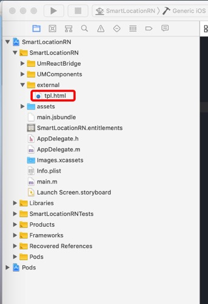
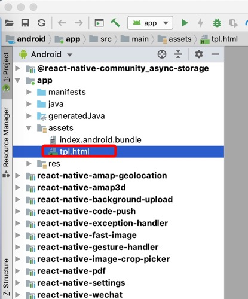

# react-native-echarts
  
## install

$ yarn add https://github.com/obzone/react-native-echarts

## Usage

The Usage is complete consistent with Echarts

component props:

* *option* (object): The option for echarts: [Documentation](http://echarts.baidu.com/option.html#title)。 
* *width* (number): The width of the chart. The default value is the outer container width. 
* *height* (number): The height of the chart. The default value is 400. 


```js
import React, { Component } from 'react';
import {
  AppRegistry,
  StyleSheet,
  Text,
  View
} from 'react-native';
import Echarts from 'react-native-echarts';

export default class app extends Component {

  constructor(props) {
    super(props)

    this.ref = React.createRef()

    this.option = {
      title: {
          text: 'ECharts demo'
      },
      tooltip: {},
      legend: {
          data:['销量']
      },
      xAxis: {
          data: ["衬衫","羊毛衫","雪纺衫","裤子","高跟鞋","袜子"]
      },
      yAxis: {},
      series: [{
          name: '销量',
          type: 'bar',
          data: [5, 20, 36, 10, 10, 20]
      }]
    };
  }

  _refreshData = () => {
    this.ref.current.refreshData(this.option)
  }

  render() {
    return (
      <Echarts ref={this.ref} option={this.option} height={300} />
    );
  }
}

AppRegistry.registerComponent('app', () => app);

```
## Additional Setup

Refer to [ReactNative: WebView with local content](https://medium.com/@snehabagri.90/reactnative-webview-with-local-content-c98a09340801)

### iOS

create a group under progrect folder named **external** if isn't exist, then right click on external and select **add files to XXX** then choose supporting file in **node_modules/react-native-echarts/components/Echarts/tpl.html**, make sure **Copy items if needed** And **Create groups** is checked。

if you finish setup it should like:



### Android

copy the **node_modules/react-native-echarts/components/Echarts/tpl.html** file to **android/app/src/main/assets/tpl.html** folder。

if you finish setup it should like:

